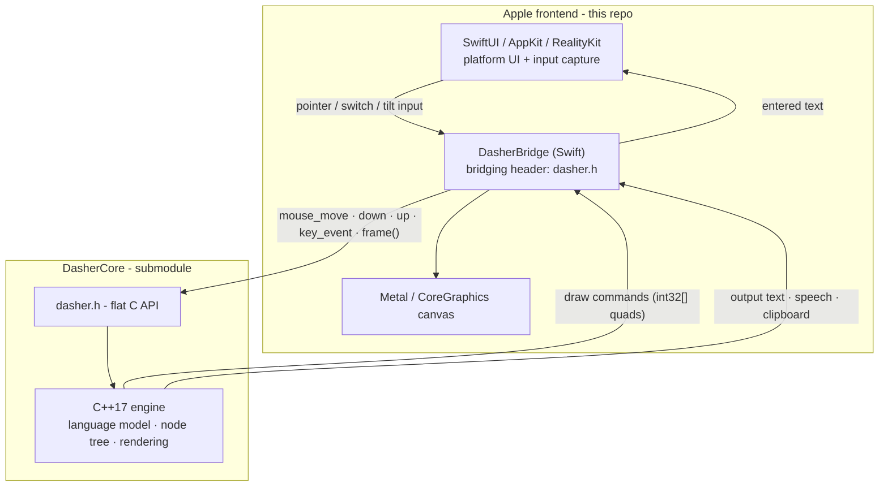

# Dasher for Apple Platforms

[](https://github.com/dasher-project/Dasher-Apple/actions/workflows/ci.yml)
[](https://github.com/dasher-project/Dasher-Apple/releases)
[](./LICENSE)

Dasher is an information-efficient text-entry interface, driven by continuous
pointing gestures. It lets you write using eye gaze, a mouse, a switch, a
joystick, or touch — designed for accessibility and augmentative communication
(AAC).

This is the **Apple** frontend — iOS, macOS, and visionOS — built on the shared
[DasherCore](https://github.com/dasher-project/DasherCore) engine.

> **[dasher.at](https://dasher.at)** — downloads, user docs, and live demo
> **[Feature status](https://dasher.at/status/)** — what each platform supports
> **[All repos](https://github.com/dasher-project)** — engine, frontends, design guide

## Status

> **Beta** — the macOS app is available as a beta; the iOS app, keyboard
> extension, and visionOS targets are in active development. See the
> [feature matrix](https://dasher.at/status/) for per-target status.

## Targets

| Target             | Platform       | Description                                  |
| :----------------- | :------------- | :------------------------------------------- |
| **DasherApp**      | iOS 17+        | Flagship iPhone/iPad app                     |
| **DasherKeyboard** | iOS 17+        | System-wide custom keyboard extension        |
| **DasherMac**      | macOS 14+      | Mac app with direct-mode (accessibility API) |
| **DasherVision**   | visionOS 1.0+  | Apple Vision Pro app with hand-tracking      |

Shared Swift lives in `DasherShared/` (access/input configuration, shared UI)
and `DasherSpeech/` (TTS via [swift-tts-wrapper](https://github.com/aactools/swift-tts-wrapper)),
managed as local Swift Package Manager targets.

## Install

Beta builds are on the [Releases page](https://github.com/dasher-project/Dasher-Apple/releases).
Not yet on the App Store. See the [feature status](https://dasher.at/status/)
for availability.

## Build

### Prerequisites

- **Xcode 16+**, **Swift 5.9+**
- **XcodeGen** and **SwiftLint** — `brew install xcodegen swiftlint`
- Git (with submodules)

### Steps

```bash
git clone --recurse-submodules https://github.com/dasher-project/Dasher-Apple.git
cd Dasher-Apple
xcodegen generate          # produces Dasher.xcodeproj
open Dasher.xcodeproj
```

Select a scheme (`DasherApp`, `DasherKeyboard`, `DasherMac`, or
`DasherVision`) and build.

> The `.xcodeproj` is **not committed** — it is regenerated from `project.yml`
> by XcodeGen on every clone. [SwiftLint](https://github.com/realm/SwiftLint)
> runs as a build phase (config in `.swiftlint.yml`). Xcode Cloud runs the
> above automatically via `ci_scripts/ci_post_clone.sh`.

## Architecture

Each frontend talks to DasherCore **only** through its flat C API
([`dasher.h`](https://github.com/dasher-project/DasherCore/blob/main/src/dasher.h))
via per-target bridging headers (`#import "dasher.h"`). DasherCore is compiled
from source as a per-platform static library; the frontend owns input capture,
canvas rendering (Metal / CoreGraphics), and platform UI (SwiftUI).



See the [architecture overview](https://dasher.at/developers/architecture/) and
[DasherCore's C API](https://github.com/dasher-project/DasherCore/blob/main/docs/C_API.md)
for the engine contract.

## Repository layout

| Directory          | Purpose                                                          |
| :----------------- | :--------------------------------------------------------------- |
| `DasherApp/`       | iOS app (SwiftUI)                                                |
| `DasherKeyboard/`  | iOS custom keyboard extension (memory-constrained, standalone)   |
| `DasherMac/`       | macOS app (SwiftUI + AppKit)                                     |
| `DasherVision/`    | visionOS app (SwiftUI + RealityKit)                              |
| `DasherShared/`    | Shared Swift — access config, input methods, UI                  |
| `DasherSpeech/`    | Shared TTS wrapper ([swift-tts-wrapper](https://github.com/aactools/swift-tts-wrapper)) |
| `DasherEngine/`    | Resource bundle (DasherCore data files)                          |
| `DasherCore/`      | **Submodule** — the C++ engine (PR upstream, don't edit here)    |

## Contributing

See [CONTRIBUTING.md](CONTRIBUTING.md) for build details, code style, the
DasherCore submodule policy, and DCO sign-off. For project-wide conventions
(code of conduct, RFCs, security), see the
[org contributing guide](https://github.com/dasher-project/.github/blob/main/CONTRIBUTING.md).

## Documentation

- [Developer handbook](https://dasher.at/developers/) — architecture, build, contributing, RFCs
- [Feature status matrix](https://dasher.at/status/) — what's supported where

## License

MIT — see [LICENSE](LICENSE). The bundled `DasherCore` submodule retains its
own [MIT license](https://github.com/dasher-project/DasherCore/blob/main/LICENSE).
